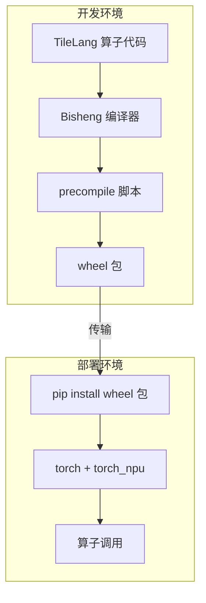
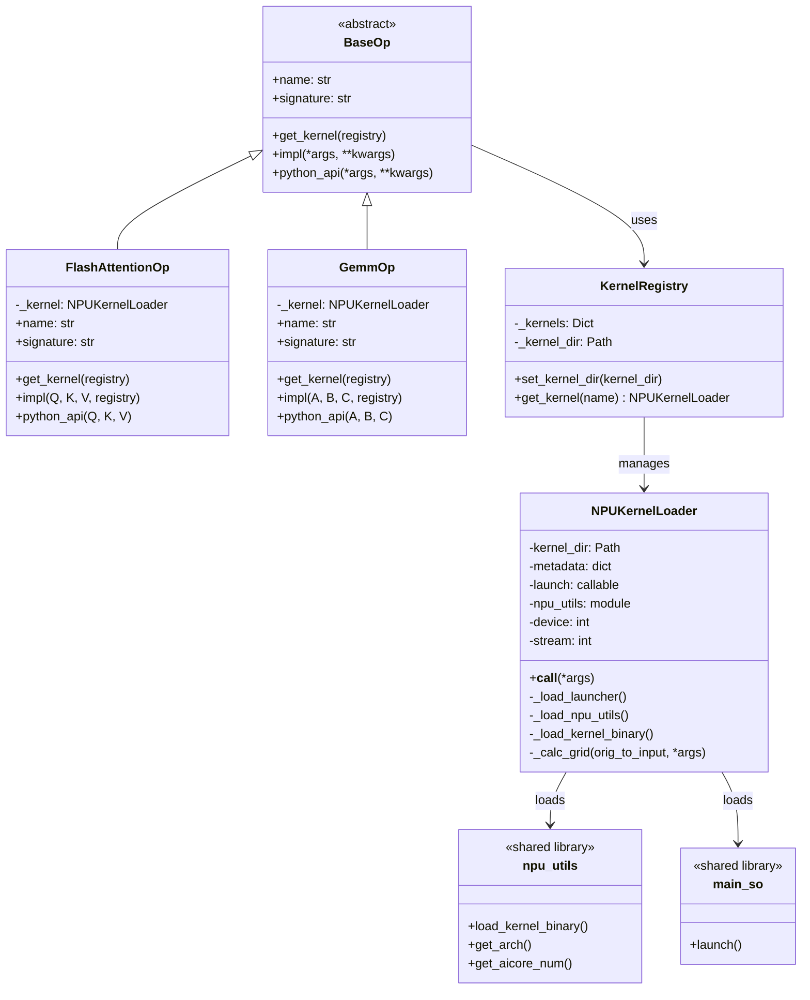
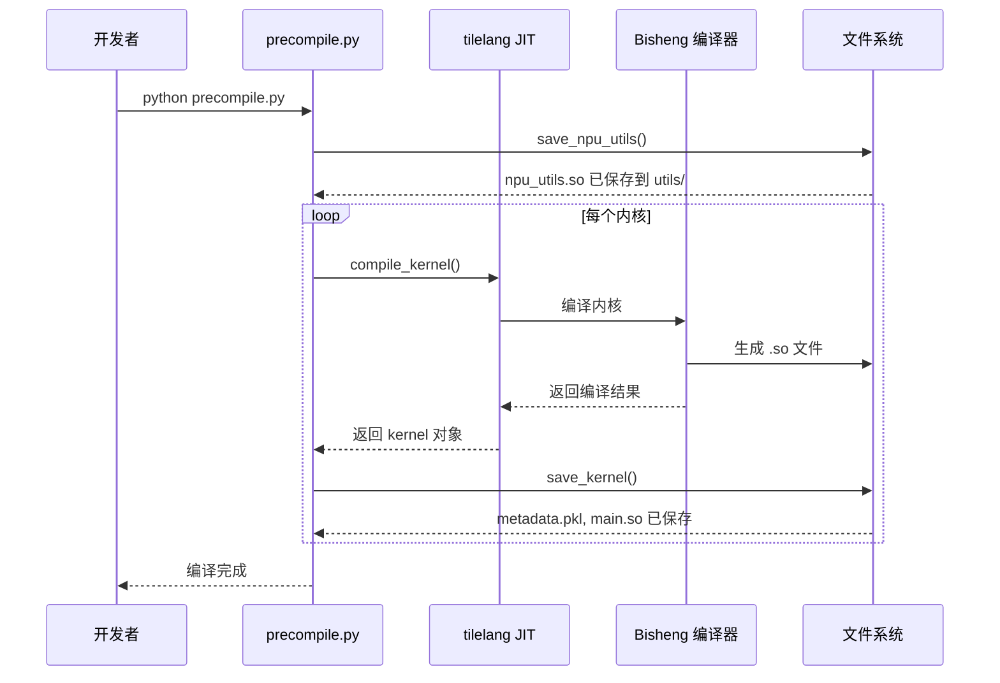
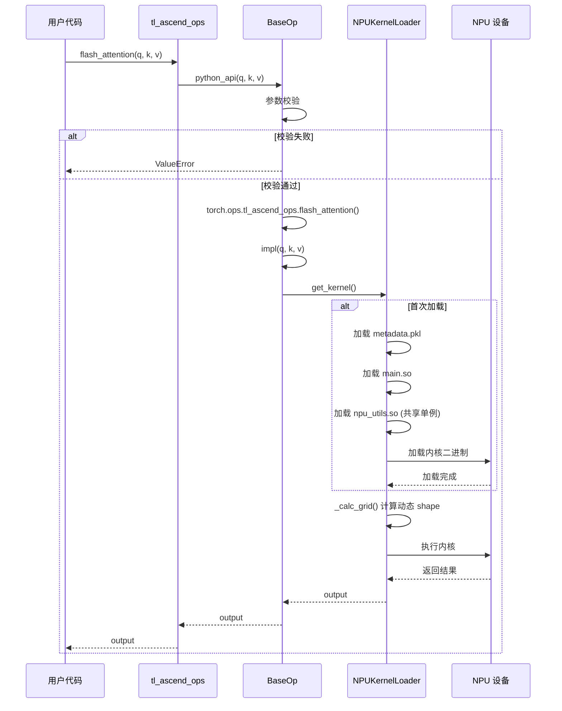
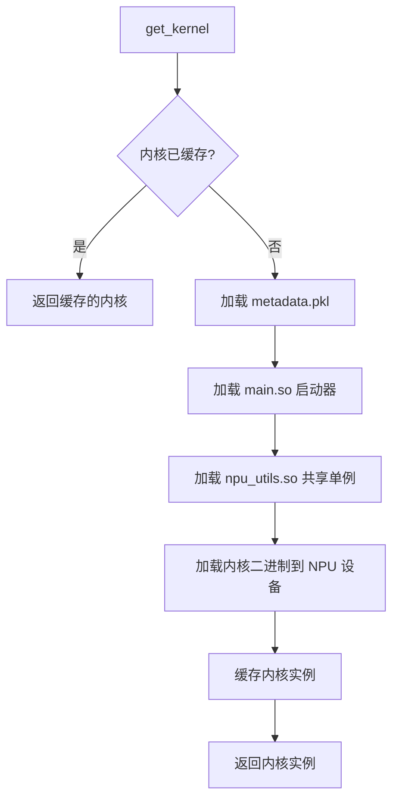
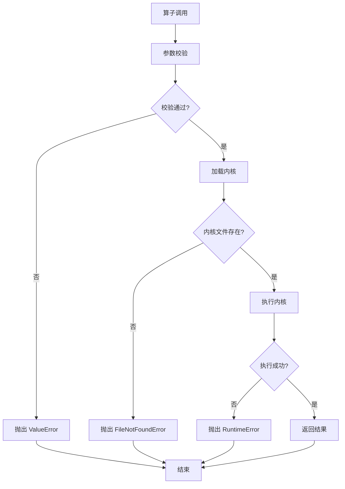

# TileLang Ascend Operators (torch_tl_ops) 需求设计文档

## 1 需求概述

### 1.1 场景目标

#### 1.1.1 背景

TileLang Ascend 是一个基于 TileLang 框架的 Ascend NPU 算子开发工具链。在开发环境中，用户可以使用 TileLang 编写高性能 NPU 算子，但部署环境中通常不具备完整的开发工具链（如 Bisheng 编译器、g++ 编译器等）。

#### 1.1.2 目标

本项目旨在提供一套**离线安装即用**的 PyTorch 算子包，实现以下目标：

1. **离线部署**：将预编译的内核打包为 wheel 包，部署环境无需编译器和开发工具链
2. **独立运行时**：运行时不依赖 tilelang 源码，仅依赖 torch 和 torch_npu
3. **PyTorch 集成**：支持多种调用方式（包调用、torch_npu 注入、torch.ops 调用）
4. **易于扩展**：提供清晰的算子开发框架，便于新增算子

#### 1.1.3 典型使用场景



### 1.2 约束限制

#### 1.2.1 环境约束

| 约束项 | 编译时 | 运行时 |
|--------|--------|--------|
| Python | >= 3.8 | >= 3.8 |
| PyTorch | > 2.6.0 | > 2.6.0 |
| torch_npu | 必须 | 必须 |
| tilelang | 必须 | **不需要** |
| Bisheng 编译器 | 必须 | **不需要** |
| g++/clang++ | 必须 | **不需要** |

#### 1.2.2 技术约束

1. **内核格式**：预编译内核为二进制格式，不可跨平台迁移
2. **Shape 限制**：当前版本支持固定 shape 和动态 shape，动态 shape 需要正确的 symbolic 参数定义
3. **设备限制**：仅支持 Ascend NPU 设备，不支持 CPU/GPU

#### 1.2.3 接口约束

1. 算子接口需符合 PyTorch 算子规范
2. 输入张量必须为 NPU 张量
3. 数据类型支持 float16、float32 等

---

## 2 实现分析设计

### 2.1 方案分析

#### 2.1.1 方案对比

| 方案 | 优点 | 缺点 | 结论 |
|------|------|------|------|
| 方案A：运行时编译 | 灵活，支持任意 shape | 部署环境需要编译器，启动慢 | ❌ 不采用 |
| 方案B：预编译+打包 | 离线可用，启动快 | shape 受限，包体积大 | ✅ 采用 |
| 方案C：AOT+JIT 混合 | 兼顾灵活性和性能 | 实现复杂 | ⏸️ 后续考虑 |

#### 2.1.2 采用方案

采用**预编译+打包**方案，核心设计：

1. **编译阶段**：在开发环境使用 tilelang 和 Bisheng 编译器生成内核
2. **打包阶段**：将内核元数据、启动器、工具库打包为 wheel 包
3. **运行阶段**：使用独立加载器加载预编译内核执行

### 2.2 模型设计

#### 2.2.1 类图



#### 2.2.2 核心类说明

| 类名 | 职责 | 关键属性/方法 |
|------|------|---------------|
| `BaseOp` | 算子基类，定义算子接口规范 | `name`, `signature`, `impl()`, `python_api()` |
| `FlashAttentionOp` | Flash Attention 算子实现 | 继承 BaseOp，实现具体算子逻辑 |
| `GemmOp` | GEMM 算子实现 | 继承 BaseOp，实现具体算子逻辑 |
| `KernelRegistry` | 内核注册中心，管理所有内核实例 | `_kernels`, `get_kernel()` |
| `NPUKernelLoader` | 独立内核加载器，加载并执行预编译内核 | `metadata`, `launch()`, `__call__()` |

#### 2.2.3 文件结构

```
torch_tl_ops/
├── src/                        # 包源码 (tl_ascend_ops)
│   ├── __init__.py             # 包入口，算子注册和注入
│   ├── loader.py               # 独立内核加载器
│   ├── registry.py             # PyTorch 算子注册
│   ├── ops/                    # 算子定义
│   │   ├── __init__.py
│   │   ├── base.py             # 算子基类
│   │   ├── flash_attention.py  # Flash Attention 算子
│   │   └── gemm.py             # GEMM 算子
│   ├── utils/                  # 共享工具库
│   │   ├── __init__.py
│   │   └── npu_utils.so        # NPU 工具库 (所有内核共享)
│   └── kernels/                # 预编译内核
│       ├── flash_attention/
│       │   ├── metadata.pkl    # 内核元数据
│       │   └── main.so         # 启动器
│       └── gemm/
│           ├── metadata.pkl
│           └── main.so
├── compile/                    # 编译脚本
│   ├── precompile.py           # 预编译脚本
│   └── kernels/                # 内核定义
│       ├── __init__.py
│       ├── flash_attention.py
│       └── gemm.py
├── tests/                      # 测试文件
│   ├── test_flash_attention.py
│   └── test_gemm.py
├── setup.py                    # 安装配置
└── README.md
```

### 2.3 流程设计

#### 2.3.1 预编译流程（顺序图）



#### 2.3.2 算子调用流程（顺序图）



#### 2.3.3 内核加载流程（活动图）



#### 2.3.4 异常处理流程



### 2.4 表设计

本项目不涉及数据库表设计。内核元数据以文件形式存储，格式如下：

#### 2.4.1 metadata.pkl 结构

```python
{
    "name": "flash_attention",           # 内核名称
    "signature": "flash_attention(...)", # PyTorch 签名
    "symbolic": {                        # 动态 shape 映射
        "M": (0, 0),                     # 变量名 -> (tensor_idx, dim_idx)
        "N": (1, 1)
    },
    "out_idx": [2],                      # 输出参数索引
    "param_info": [                      # 参数信息
        {
            "is_output": False,
            "dtype": torch.float16,
            "shape": [512, 128]
        },
        ...
    ],
    "gridfunc": "ceildiv(M, 128) * ceildiv(N, 128)",  # Grid 计算表达式
    "kernel_src": b"...",                # 内核二进制
    "tensor_kinds": [...],               # 张量类型信息
    "shared": 1,                         # 共享内存大小
    "mix_mode": False                    # 是否混合模式
}
```

### 2.5 接口设计

#### 2.5.1 用户接口

**方式一：包调用**

```python
import tl_ascend_ops

output = tl_ascend_ops.flash_attention(q, k, v)
c = tl_ascend_ops.gemm(a, b)
```

**方式二：torch_npu 注入**

```python
import torch_npu
import tl_ascend_ops  # 触发注入

output = torch_npu.flash_attention(q, k, v)
c = torch_npu.gemm(a, b)
```

**方式三：torch.ops 调用**

```python
output = torch.ops.tl_ascend_ops.flash_attention(q, k, v)
torch.ops.tl_ascend_ops.gemm(a, b, c)
```

#### 2.5.2 算子开发接口

```python
from tl_ascend_ops.ops.base import BaseOp

class MyOp(BaseOp):
    @property
    def name(self) -> str:
        return "my_op"
    
    @property
    def signature(self) -> str:
        return "my_op(Tensor A, Tensor B) -> Tensor"
    
    def get_kernel(self, registry):
        return registry.get_kernel(self.name)
    
    def impl(self, A, B, registry=None):
        kernel = self.get_kernel(registry)
        return kernel(A, B)
    
    def python_api(self, A, B):
        # 参数校验
        if A.device.type != "npu":
            raise ValueError("A must be an NPU tensor")
        return torch.ops.tl_ascend_ops.my_op(A, B)
```

#### 2.5.3 内核注册接口

```python
# 在 src/registry.py 中注册
def register_all_ops():
    from .ops.my_op import my_op
    ops = {
        "my_op": my_op,
    }
    for name, op in ops.items():
        _register_op(op)
    return ops
```

### 2.6 升级设计

#### 2.6.1 版本号规范

采用语义化版本号：`MAJOR.MINOR.PATCH`

- **MAJOR**：不兼容的 API 变更
- **MINOR**：向后兼容的功能新增
- **PATCH**：向后兼容的问题修复

#### 2.6.2 升级流程


#### 2.6.3 内核版本兼容性

内核二进制与 NPU 驱动版本相关，升级时需注意：

1. 同一 NPU 驱动版本下，wheel 包可直接升级
2. NPU 驱动升级后，需重新编译内核并打包

### 2.7 兼容性分析设计

#### 2.7.1 Python 版本兼容性

| Python 版本 | 支持状态 |
|-------------|----------|
| 3.7 | ❌ 不支持 |
| 3.8 | ✅ 支持 |
| 3.9 | ✅ 支持 |
| 3.10 | ✅ 支持 |
| 3.11 | ✅ 支持 |

#### 2.7.2 PyTorch 版本兼容性

| PyTorch 版本 | 支持状态 |
|--------------|----------|
| <= 2.5.x | ❌ 不支持（缺少 torch.library API） |
| 2.6.x | ✅ 支持 |
| 2.7.x+ | ✅ 支持（待验证） |

#### 2.7.3 NPU 硬件兼容性

| NPU 型号 | 支持状态 |
|----------|----------|
| Ascend 910 | ✅ 支持 |
| Ascend 310 | ⏸️ 待验证 |

### 2.8 安全分析

#### 2.8.1 安全风险

| 风险项 | 风险等级 | 描述 | 缓解措施 |
|--------|----------|------|----------|
| 内核二进制篡改 | 中 | 预编译内核可能被恶意替换 | 建议使用签名验证 |
| pickle 反序列化 | 中 | metadata.pkl 使用 pickle 格式 | 仅加载可信来源的包 |
| 代码注入 | 低 | torch_npu 注入可能被滥用 | 注入仅限于已注册算子 |

#### 2.8.2 安全建议

1. **来源验证**：仅从可信渠道获取 wheel 包
2. **完整性校验**：发布时提供 SHA256 校验和
3. **权限控制**：限制生产环境中的包安装权限

---

## 3 开发者测试设计

### 3.1 场景1：算子基本功能测试

#### 3.1.1 测试目标

验证算子在正常输入下能正确执行并返回正确结果。

#### 3.1.2 测试用例

```python
def test_flash_attention_basic():
    """测试 Flash Attention 基本功能"""
    import torch
    import tl_ascend_ops
    
    # 准备输入
    seq_len, dim = 512, 128
    q = torch.randn(seq_len, dim, dtype=torch.float16, device="npu")
    k = torch.randn(seq_len, dim, dtype=torch.float16, device="npu")
    v = torch.randn(seq_len, dim, dtype=torch.float16, device="npu")
    
    # 执行算子
    output = tl_ascend_ops.flash_attention(q, k, v)
    
    # 验证输出
    assert output.shape == (seq_len, dim)
    assert output.dtype == torch.float16
    assert output.device.type == "npu"
```

### 3.2 场景2：参数校验测试

#### 3.2.1 测试目标

验证算子对非法输入的正确处理。

#### 3.2.2 测试用例

```python
def test_flash_attention_invalid_device():
    """测试非 NPU 张量输入"""
    import torch
    import tl_ascend_ops
    import pytest
    
    q = torch.randn(512, 128, dtype=torch.float16, device="cpu")
    k = torch.randn(512, 128, dtype=torch.float16, device="cpu")
    v = torch.randn(512, 128, dtype=torch.float16, device="cpu")
    
    with pytest.raises(ValueError, match="must be an NPU tensor"):
        tl_ascend_ops.flash_attention(q, k, v)

def test_flash_attention_shape_mismatch():
    """测试 Shape 不匹配"""
    import torch
    import tl_ascend_ops
    import pytest
    
    q = torch.randn(512, 128, dtype=torch.float16, device="npu")
    k = torch.randn(256, 128, dtype=torch.float16, device="npu")  # 错误的 seq_len
    v = torch.randn(512, 128, dtype=torch.float16, device="npu")
    
    with pytest.raises(ValueError, match="Shape mismatch"):
        tl_ascend_ops.flash_attention(q, k, v)
```

### 3.3 场景3：多调用方式测试

#### 3.3.1 测试目标

验证三种调用方式结果一致。

#### 3.3.2 测试用例

```python
def test_flash_attention_call_methods():
    """测试多种调用方式"""
    import torch
    import torch_npu
    import tl_ascend_ops
    
    q = torch.randn(512, 128, dtype=torch.float16, device="npu")
    k = torch.randn(512, 128, dtype=torch.float16, device="npu")
    v = torch.randn(512, 128, dtype=torch.float16, device="npu")
    
    # 方式1：包调用
    output1 = tl_ascend_ops.flash_attention(q, k, v)
    
    # 方式2：torch_npu 调用
    output2 = torch_npu.flash_attention(q, k, v)
    
    # 方式3：torch.ops 调用
    output3 = torch.ops.tl_ascend_ops.flash_attention(q, k, v)
    
    # 验证结果一致
    torch.testing.assert_close(output1, output2)
    torch.testing.assert_close(output1, output3)
```

### 3.4 场景4：内核加载测试

#### 3.4.1 测试目标

验证内核加载和缓存机制。

#### 3.4.2 测试用例

```python
def test_kernel_caching():
    """测试内核缓存"""
    from tl_ascend_ops.loader import KernelRegistry
    
    # 首次加载
    kernel1 = KernelRegistry.get_kernel("flash_attention")
    
    # 再次加载（应返回缓存实例）
    kernel2 = KernelRegistry.get_kernel("flash_attention")
    
    # 验证是同一实例
    assert kernel1 is kernel2

def test_kernel_not_found():
    """测试内核不存在"""
    from tl_ascend_ops.loader import KernelRegistry
    import pytest
    
    with pytest.raises(ValueError, match="not found"):
        KernelRegistry.get_kernel("nonexistent_kernel")
```

### 3.5 场景5：预编译流程测试

#### 3.5.1 测试目标

验证预编译脚本正确生成内核文件。

#### 3.5.2 测试用例

```python
def test_precompile_generates_files():
    """测试预编译生成文件"""
    import os
    from pathlib import Path
    
    # 运行预编译
    # ... (调用 precompile.py)
    
    # 验证文件生成
    kernel_dir = Path("src/kernels/flash_attention")
    assert (kernel_dir / "metadata.pkl").exists()
    assert (kernel_dir / "main.so").exists()
    
    # 验证共享工具库
    utils_dir = Path("src/utils")
    assert (utils_dir / "npu_utils.so").exists()
```

---

## 附录

### A. 内核元数据字段说明

| 字段 | 类型 | 说明 |
|------|------|------|
| `name` | str | 内核名称，用于目录和注册 |
| `signature` | str | PyTorch 算子签名 |
| `symbolic` | dict | 动态 shape 变量映射 |
| `out_idx` | list | 输出参数索引列表 |
| `param_info` | list | 参数详细信息 |
| `gridfunc` | str | Grid 维度计算表达式 |
| `kernel_src` | bytes | 内核二进制数据 |
| `tensor_kinds` | list | 张量类型信息 |
| `shared` | int | 共享内存大小 |
| `mix_mode` | bool | 是否混合模式（AI Core + AI Vector） |

### B. 错误码定义

| 错误码 | 错误类型 | 说明 |
|--------|----------|------|
| E001 | ValueError | 参数校验失败 |
| E002 | FileNotFoundError | 内核文件不存在 |
| E003 | RuntimeError | 内核执行失败 |
| E004 | ImportError | 依赖模块加载失败 |

### C. 参考资料

1. [PyTorch Custom Operators](https://pytorch.org/tutorials/advanced/custom_ops.html)
2. [torch_npu Documentation](https://gitee.com/ascend/pytorch)
3. [TileLang Documentation](https://github.com/tile-ai/tilelang)
