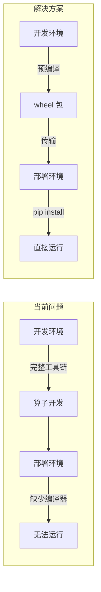
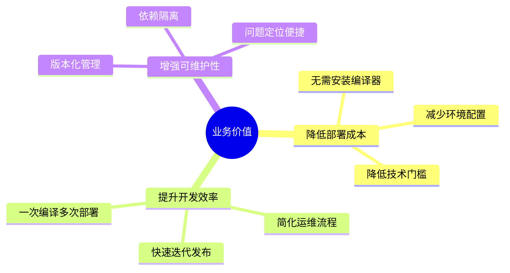
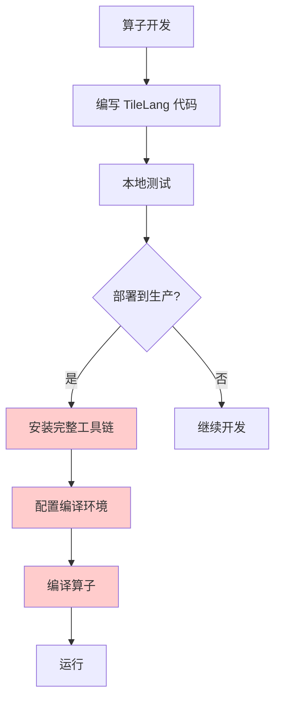
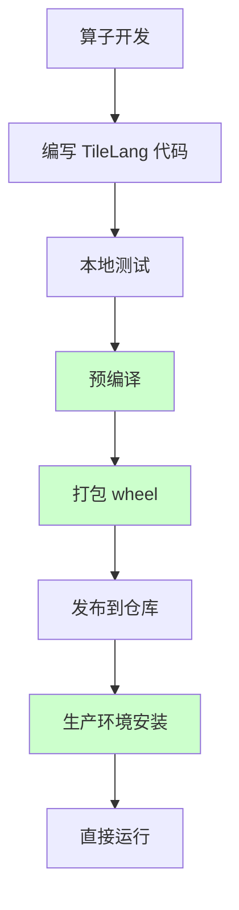
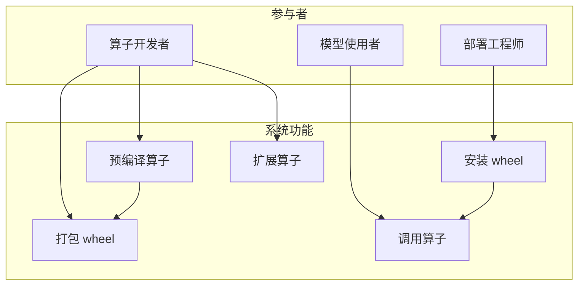
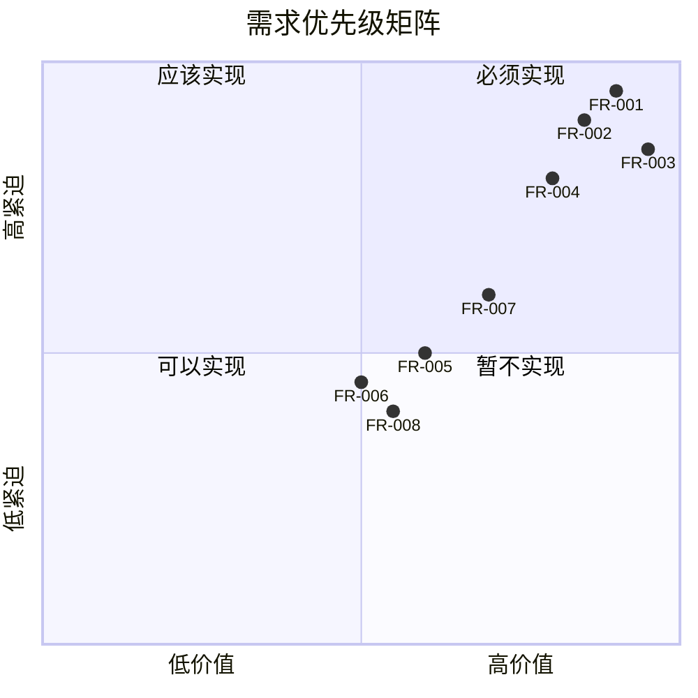

# TileLang Ascend Operators (torch_tl_ops) 需求分析文档

## 文档信息

| 项目 | 内容 |
|------|------|
| 项目名称 | TileLang Ascend Operators (torch_tl_ops) |
| 文档版本 | V1.0 |
| 创建日期 | 2026-03-27 |
| 文档状态 | 初稿 |

---

## 1 引言

### 1.1 编写目的

本文档旨在明确 TileLang Ascend Operators 项目的需求，为项目开发、测试和验收提供依据。主要读者包括：

- 项目开发人员
- 测试人员
- 项目管理人员
- 技术评审人员

### 1.2 项目背景

#### 1.3.1 行业背景

随着人工智能技术的快速发展，NPU（神经网络处理器）在深度学习领域的应用越来越广泛。华为 Ascend NPU 作为国产高性能 AI 处理器，在训练和推理场景中发挥着重要作用。

#### 1.3.2 技术背景

TileLang 是一个高性能算子开发框架，支持使用 Python-like 语法编写 NPU 算子。然而，TileLang 的运行时依赖较重：

- 需要 Bisheng 编译器（华为昇腾编译器）
- 需要 g++/clang++ 等系统编译器
- 需要 tilelang 源码和运行时环境

这些依赖在生产部署环境中往往不可用或不便于安装。

#### 1.3.3 问题陈述



### 1.3 术语定义

| 术语 | 定义 |
|------|------|
| TileLang | 高性能算子开发框架，支持多种硬件后端 |
| Ascend NPU | 华为昇腾神经网络处理器 |
| Bisheng | 华为昇腾编译器，用于编译 NPU 内核 |
| AOT | Ahead-of-Time，提前编译 |
| JIT | Just-in-Time，即时编译 |
| wheel | Python 包分发格式 |
| torch_npu | PyTorch 的 Ascend NPU 后端扩展 |

### 1.4 参考资料

1. [PyTorch Custom Operators Documentation](https://pytorch.org/tutorials/advanced/custom_ops.html)
2. [torch_npu 官方文档](https://gitee.com/ascend/pytorch)
3. [TileLang GitHub Repository](https://github.com/tile-ai/tilelang)
4. [华为昇腾开发文档](https://www.hiascend.com/document)

---

## 2 业务需求分析

### 2.1 业务目标

#### 2.1.1 核心业务目标

| 目标编号 | 目标描述 | 优先级 |
|----------|----------|--------|
| BO-001 | 实现算子的离线部署能力，降低部署环境要求 | 高 |
| BO-002 | 提供与 PyTorch 原生算子一致的使用体验 | 高 |
| BO-003 | 支持算子的灵活扩展，便于后续新增算子 | 中 |
| BO-004 | 保证算子执行性能与在线编译方式相当 | 中 |

#### 2.1.2 业务价值



### 2.2 用户角色分析

| 角色名称 | 角色描述 | 主要职责 | 关注点 |
|----------|----------|----------|--------|
| 算子开发者 | 使用 TileLang 开发 NPU 算子 | 编写算子代码、预编译、打包 | 开发便捷性、调试能力 |
| 模型部署工程师 | 负责模型在生产环境部署 | 安装 wheel 包、集成到推理服务 | 安装简单、运行稳定 |
| 算法研究员 | 使用算子进行模型训练和推理 | 调用算子 API | 接口友好、性能优秀 |
| 运维工程师 | 维护生产环境 | 环境配置、问题排查 | 依赖少、日志清晰 |

### 2.3 业务流程分析

#### 2.3.1 当前业务流程（问题现状）



**问题点**：
- E、F、G 步骤在生产环境难以执行
- 编译环境配置复杂，容易出错
- 编译时间长，影响部署效率

#### 2.3.2 目标业务流程



**改进点**：
- 预编译在开发环境完成
- 生产环境仅需 pip install
- 部署时间从小时级降至分钟级

---

## 3 功能需求分析

### 3.1 功能需求列表

| 需求编号 | 需求名称 | 需求描述 | 优先级 | 来源 |
|----------|----------|----------|--------|------|
| FR-001 | 算子预编译 | 支持将 TileLang 算子预编译为二进制格式 | 高 | BO-001 |
| FR-002 | wheel 包打包 | 支持将预编译产物打包为 Python wheel 包 | 高 | BO-001 |
| FR-003 | 离线安装 | 支持在无编译器的环境中安装和运行 | 高 | BO-001 |
| FR-004 | PyTorch 集成 | 支持通过 torch.ops 调用算子 | 高 | BO-002 |
| FR-005 | torch_npu 注入 | 支持将算子注入到 torch_npu 模块 | 中 | BO-002 |
| FR-006 | 包级调用 | 支持直接通过包名调用算子 | 中 | BO-002 |
| FR-007 | 动态 Shape | 支持动态 shape 的算子执行 | 中 | BO-003 |
| FR-008 | 算子扩展 | 提供算子开发框架，支持新增算子 | 中 | BO-003 |
| FR-009 | 错误处理 | 提供清晰的错误信息和异常处理 | 中 | BO-004 |
| FR-010 | 日志记录 | 支持运行时日志记录和调试 | 低 | BO-004 |

### 3.2 功能需求详细描述

#### 3.2.1 FR-001 算子预编译

**需求描述**：
提供预编译脚本，将 TileLang 算子代码编译为可离线运行的二进制格式。

**输入**：
- TileLang 算子源码
- 编译配置参数

**输出**：
- 内核二进制文件
- 启动器动态库
- 元数据文件

**验收标准**：
- [ ] 预编译脚本可正常执行
- [ ] 生成的二进制文件可在目标环境运行
- [ ] 预编译过程有清晰的进度提示

#### 3.2.2 FR-002 wheel 包打包

**需求描述**：
将预编译产物打包为标准 Python wheel 包，支持 pip 安装。

**输入**：
- 预编译产物（二进制文件、元数据）
- setup.py 配置

**输出**：
- wheel 包文件

**验收标准**：
- [ ] 生成的 wheel 包符合 Python 包规范
- [ ] 支持 pip install 安装
- [ ] 包含所有必要的依赖声明

#### 3.2.3 FR-003 离线安装

**需求描述**：
在无编译器的环境中安装和运行算子包。

**环境要求**：
- Python >= 3.8
- PyTorch > 2.6.0
- torch_npu

**验收标准**：
- [ ] 在纯净环境中可成功安装
- [ ] 安装后无需额外配置即可运行
- [ ] 不依赖 tilelang 源码

#### 3.2.4 FR-004 PyTorch 集成

**需求描述**：
支持通过 PyTorch 标准方式调用算子。

**调用方式**：
```python
import torch
output = torch.ops.tl_ascend_ops.flash_attention(q, k, v)
```

**验收标准**：
- [ ] 支持 torch.ops 调用方式
- [ ] 算子签名符合 PyTorch 规范
- [ ] 支持自动求导（如适用）

#### 3.2.5 FR-005 torch_npu 注入

**需求描述**：
支持将算子注入到 torch_npu 模块，提供更便捷的调用方式。

**调用方式**：
```python
import torch_npu
import tl_ascend_ops  # 触发注入
output = torch_npu.flash_attention(q, k, v)
```

**验收标准**：
- [ ] 导入包后自动注入 torch_npu
- [ ] 注入不影响 torch_npu 原有功能
- [ ] 支持多个算子同时注入

#### 3.2.6 FR-006 包级调用

**需求描述**：
支持直接通过包名调用算子。

**调用方式**：
```python
import tl_ascend_ops
output = tl_ascend_ops.flash_attention(q, k, v)
```

**验收标准**：
- [ ] 支持包级函数调用
- [ ] 提供完整的函数签名和文档
- [ ] 支持代码补全

#### 3.2.7 FR-007 动态 Shape

**需求描述**：
支持动态 shape 的算子执行，无需为每个 shape 重新编译。

**实现方式**：
- 通过 symbolic 参数定义动态维度
- 运行时根据输入 shape 计算 Grid

**验收标准**：
- [ ] 支持预定义的动态维度
- [ ] 不同 shape 的输入可复用同一内核
- [ ] 动态 shape 计算正确

#### 3.2.8 FR-008 算子扩展

**需求描述**：
提供算子开发框架，支持开发者新增自定义算子。

**开发流程**：
1. 继承 BaseOp 基类
2. 实现必要的方法
3. 注册算子
4. 预编译

**验收标准**：
- [ ] 提供清晰的算子开发指南
- [ ] BaseOp 基类接口设计合理
- [ ] 新增算子流程简单明了

### 3.3 用例分析

#### 3.3.1 用例图



#### 3.3.2 用例描述

**UC-001 预编译算子**

| 项目 | 内容 |
|------|------|
| 用例名称 | 预编译算子 |
| 参与者 | 算子开发者 |
| 前置条件 | 已安装 TileLang 和 Bisheng 编译器 |
| 主成功场景 | 1. 开发者执行预编译脚本<br>2. 系统编译算子<br>3. 系统生成预编译产物<br>4. 系统输出编译结果 |
| 后置条件 | 预编译产物已保存到指定目录 |
| 异常场景 | 编译失败：显示错误信息，提示开发者修复 |

**UC-002 调用算子**

| 项目 | 内容 |
|------|------|
| 用例名称 | 调用算子 |
| 参与者 | 模型使用者 |
| 前置条件 | 已安装 tl_ascend_ops 包和 torch_npu |
| 主成功场景 | 1. 使用者导入包<br>2. 使用者准备输入张量<br>3. 使用者调用算子<br>4. 系统执行算子<br>5. 系统返回结果 |
| 后置条件 | 返回正确的计算结果 |
| 异常场景 | 输入不合法：抛出 ValueError，提示错误原因 |

---

## 4 非功能需求分析

### 4.1 性能需求

| 需求编号 | 需求描述 | 指标要求 |
|----------|----------|----------|
| NFR-P001 | 算子执行性能 | 与在线编译方式性能差异 < 5% |
| NFR-P002 | 包安装时间 | < 30 秒 |
| NFR-P003 | 首次算子加载时间 | < 1 秒 |
| NFR-P004 | wheel 包大小 | < 100 MB（单算子） |

### 4.2 可靠性需求

| 需求编号 | 需求描述 | 指标要求 |
|----------|----------|----------|
| NFR-R001 | 运行稳定性 | 连续运行 24 小时无崩溃 |
| NFR-R002 | 内存管理 | 无内存泄漏 |
| NFR-R003 | 错误恢复 | 异常后可正常继续使用 |

### 4.3 可用性需求

| 需求编号 | 需求描述 | 指标要求 |
|----------|----------|----------|
| NFR-U001 | 安装便捷性 | 一条命令完成安装 |
| NFR-U002 | 接口一致性 | 与 PyTorch 原生算子接口风格一致 |
| NFR-U003 | 文档完整性 | 提供完整的 API 文档和使用示例 |
| NFR-U004 | 错误提示 | 错误信息清晰，包含解决建议 |

### 4.4 可维护性需求

| 需求编号 | 需求描述 | 指标要求 |
|----------|----------|----------|
| NFR-M001 | 代码规范 | 遵循 PEP 8 编码规范 |
| NFR-M002 | 模块化设计 | 核心模块低耦合 |
| NFR-M003 | 日志记录 | 支持多级别日志输出 |
| NFR-M004 | 版本管理 | 遵循语义化版本规范 |

### 4.5 兼容性需求

| 需求编号 | 需求描述 | 指标要求 |
|----------|----------|----------|
| NFR-C001 | Python 版本 | 支持 Python 3.8+ |
| NFR-C002 | PyTorch 版本 | 支持 PyTorch 2.6+ |
| NFR-C003 | NPU 硬件 | 支持 Ascend 910 |
| NFR-C004 | 操作系统 | 支持 Linux |

### 4.6 安全性需求

| 需求编号 | 需求描述 | 指标要求 |
|----------|----------|----------|
| NFR-S001 | 代码安全 | 无已知安全漏洞 |
| NFR-S002 | 依赖安全 | 依赖包无已知高危漏洞 |
| NFR-S003 | 数据安全 | 不泄露敏感信息 |

---

## 5 需求优先级分析

### 5.1 MoSCoW 优先级划分



### 5.2 迭代规划

| 迭代 | 版本 | 包含需求 | 交付目标 |
|------|------|----------|----------|
| 迭代1 | V0.1 | FR-001, FR-002, FR-003 | 基础离线部署能力 |
| 迭代2 | V0.2 | FR-004, FR-005, FR-006 | PyTorch 集成 |
| 迭代3 | V0.3 | FR-007, FR-008 | 动态 Shape 和扩展能力 |
| 迭代4 | V1.0 | FR-009, FR-010, 全部 NFR | 正式发布版本 |

---

## 6 需求追踪矩阵

### 6.1 业务需求到功能需求追踪

| 业务需求 | 功能需求 |
|----------|----------|
| BO-001 离线部署 | FR-001, FR-002, FR-003 |
| BO-002 PyTorch 集成 | FR-004, FR-005, FR-006 |
| BO-003 算子扩展 | FR-007, FR-008 |
| BO-004 性能保证 | NFR-P001, NFR-P003 |

### 6.2 功能需求到测试用例追踪

| 功能需求 | 测试用例 |
|----------|----------|
| FR-001 算子预编译 | TC-001 预编译基本功能测试 |
| FR-002 wheel 打包 | TC-002 wheel 包安装测试 |
| FR-003 离线安装 | TC-003 纯净环境安装测试 |
| FR-004 PyTorch 集成 | TC-004 torch.ops 调用测试 |
| FR-005 torch_npu 注入 | TC-005 注入功能测试 |
| FR-006 包级调用 | TC-006 包调用测试 |
| FR-007 动态 Shape | TC-007 动态 shape 测试 |
| FR-008 算子扩展 | TC-008 新增算子测试 |

---

## 7 风险分析

### 7.1 技术风险

| 风险编号 | 风险描述 | 可能性 | 影响 | 风险等级 | 应对措施 |
|----------|----------|--------|------|----------|----------|
| TR-001 | NPU 驱动版本不兼容 | 中 | 高 | 高 | 提供版本兼容性说明，建议使用相同驱动版本 |
| TR-002 | PyTorch API 变更 | 低 | 中 | 低 | 使用稳定的公开 API，关注 PyTorch 版本更新 |
| TR-003 | 二进制格式不兼容 | 中 | 高 | 高 | 明确支持的硬件和驱动版本范围 |
| TR-004 | 性能不达预期 | 低 | 中 | 低 | 进行性能基准测试，优化关键路径 |

### 7.2 项目风险

| 风险编号 | 风险描述 | 可能性 | 影响 | 风险等级 | 应对措施 |
|----------|----------|--------|------|----------|----------|
| PR-001 | 需求变更 | 中 | 中 | 中 | 采用迭代开发，快速响应变更 |
| PR-002 | 资源不足 | 低 | 高 | 中 | 合理规划迭代内容，优先核心功能 |
| PR-003 | 技术难点攻关 | 中 | 中 | 中 | 预留技术预研时间，准备备选方案 |

---

## 8 验收标准

### 8.1 功能验收标准

| 验收项 | 验收标准 | 验收方法 |
|--------|----------|----------|
| 预编译功能 | 可成功预编译 TileLang 算子 | 执行预编译脚本，检查产物 |
| wheel 打包 | 生成的 wheel 包可正常安装 | pip install 测试 |
| 离线运行 | 在无编译器环境中正常运行 | 纯净环境测试 |
| PyTorch 集成 | 支持三种调用方式 | 功能测试 |
| 动态 Shape | 支持动态 shape 执行 | 多 shape 测试 |

### 8.2 非功能验收标准

| 验收项 | 验收标准 | 验收方法 |
|--------|----------|----------|
| 性能 | 与在线编译性能差异 < 5% | 性能基准测试 |
| 稳定性 | 连续运行 24 小时无崩溃 | 稳定性测试 |
| 兼容性 | 支持 Python 3.8+, PyTorch 2.6+ | 兼容性测试 |

---

## 附录

### A. 需求变更记录

| 版本 | 日期 | 变更内容 | 变更人 |
|------|------|----------|--------|
| V1.0 | 2026-03-27 | 初稿创建 | - |

### B. 评审记录

| 评审日期 | 评审人 | 评审意见 | 处理结果 |
|----------|--------|----------|----------|
| - | - | - | - |
